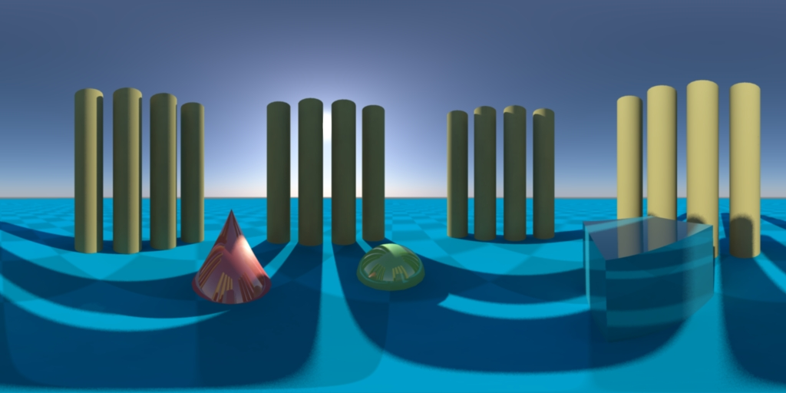

# `latlong_lens` for Mental Ray Version 2.0 #
**Jan 12, 2013 - Version 2.1**

Created by Ralf Habel   
[ralf.habel@vi-motion.de](mailto:ralf.habel@vi-motion.de)

The 64-bit Windows, Mac, and Linux compiles, the new Maya icon, and 3DS Max Support was added by Andrew Hazelden.

[andrewhazelden@gmail.com](mailto:andrewhazelden@gmail.com)  
[http://www.andrewhazelden.com/blog](http://www.andrewhazelden.com/blog)  

## About the Shader ##
The `latlong_lens` shader is useful for rendering equirectangular projection images and 360°x 180° spherical panoramas. If you render your scene to a floating point .EXR high dynamic range image with the Lat Long lens shader, you can use the resulting image in a scene with the Maya IBL node as a source of final gather illumination and as the reflected environment map. 

The Windows 64-bit version of the `latlong_lens` shader now supports 3DS Max + mental ray.

## LatLong Lens Shader Installation ##

### Maya Installation ###

On Windows the Microsoft Visual C++ 2010 Redistributable Package (x64) is required:  

[`http://bit.ly/VisualC_2010_Redistributable_x64`](http://bit.ly/VisualC_2010_Redistributable_x64)

**Step 1.** Unzip the `latlong_lens` shader's zip archive. (done)

**Step 2.** Copy the `"latlong_lens.dll"` file from the lib folder to your mental ray LIB folder:

On Maya 2012:

`C:\Program Files\Autodesk\Maya2012\mentalray\lib\`

On Maya 2013:

`C:\Program Files\Autodesk\Maya2013\mentalray\shaders\`

On Maya 2014:

`C:\Program Files\Autodesk\mentalrayForMaya2014\shaders\`

**Step 3.** Copy the `"latlong_lens.mi"` mental ray include file to the include folder.

On Maya 2012:

`C:\Program Files\Autodesk\Maya2012\mentalray\include\`

On Maya 2013:

`C:\Program Files\Autodesk\Maya2013\mentalray\shaders\include`

On Maya 2014:

`C:\Program Files\Autodesk\mentalrayForMaya2014\shaders\include\`

**Step 4.** Copy the Hypershade icons from the "icons" folder to your Maya icons directory or to your user account's Maya icons directory:

`C:\Program Files\Autodesk\<maya version>\icons\`

or

`My Documents\maya\<maya version>\prefs\icons\`

After the shader is installed restart Maya.

The LatLong lens shader will show up in the mental ray lenses section in the Maya Hypershade. To use the lens shader add it to the work area and then use the middle mouse button to drag the shader onto your camera's node icon in the Hypershade.

In the connection popup menu select default. The lens shader should be connected to the camera's .miLensShader input.

If you are interested in using the `latlong_lens` shader with a the mental ray "Physical Sun and Sky" system or a mental ray tonemapping node like mia_exposure_simple you should reading this blog post:
http://www.andrewhazelden.com/blog/2012/06/connecting-multiple-mental-ray-lens-shaders-in-maya/

**Note:** There appears to be a compatibility issue with the `latlong_lens` shader and Maya 2013 SP1. This bug is solved by either using Maya 2013 or upgrading to Maya 2013 SP2.

### 3DS Max Installation ###

On Windows the Microsoft Visual C++ 2010 Redistributable Package (x64) is required:  
[`http://bit.ly/VisualC_2010_Redistributable_x64`](http://bit.ly/VisualC_2010_Redistributable_x64)

**Step 1.** Unzip the `latlong_lens` shader's zip archive. (done)

**Step 2.** Copy the `"latlong_lens.dll"` file from the lib folder to your mental ray LIB folder:

Max 2010 and before:  
`<maxdir>\mentalray\shaders_autoload\shaders\latlong_lens.dll`

Max 2011 and 2012:  
`<maxdir>\mentalimages\shaders_autoload\mentalray\shaders\latlong_lens.dll`

Max 2013 and newer:  
`<maxdir>\NVIDIA\shaders_autoload\mentalray\shaders\latlong_lens.dll`

**Step 3.** Copy the `"latlong_lens.mi"` mental ray include file to the include folder.

Max 2010 and before:   
`<maxdir>\mentalray\shaders_autoload\include\latlong_lens.mi`

Max 2011 and 2012:  
`<maxdir>\mentalimages\shaders_autoload\mentalray\include\latlong_lens.mi`

Max 2013 and newer:  
`<maxdir>\NVIDIA\shaders_autoload\mentalray\include\latlong_lens.mi`

### Mental Ray Standalone ###

The lens shader has one parameter which mirrors the output on a centered vertical line:

`lens "latlong_lens" ("m_vmirror" [0,1])`

Be sure to turn off scanline rendering.

## Sample Maya Project ##

A sample Maya project file is included. This scene can be used to test the `latlong_lens` shader installation.

## Links ##
For more information about the x64 builds of the `latlong_lens` shader check out the blog page:  

[latlong_lens for Windows x64 Blog](http://www.andrewhazelden.com/blog/2011/01/latlong_lens-and-cubemap_lens-mental-ray-shaders-compiled-for-maya-2011-x64-on-windows/ "latlong_lens for Windows X64")

A tutorial on how to use the shader can be found at:  
[http://www.vi-motion.de/latlong_Tutorial/](http://www.vi-motion.de/latlong_Tutorial/)
