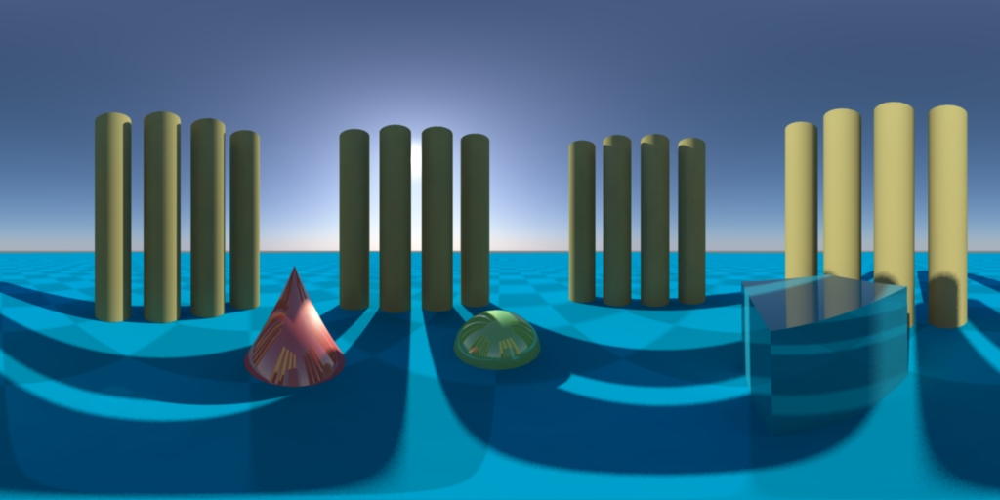

# `LatLong_lens` shader for mental ray x64 #
**Jan 12, 2013 - Version 2.1**

The original `latlong_lens` shader was written by Ralf Habel  
[ralf.habel@vi-motion.de](mailto:ralf.habel@vi-motion.de)

64-bit compiles, and 3DS Max +  Softimage Support by Andrew Hazelden  
[andrew@andrewhazelden.com](mailto:andrew@andrewhazelden.com)  
[http://www.andrewhazelden.com/blog](http://www.andrewhazelden.com/blog) 

## Overview ##
This package includes the Mac OS X x64, Windows x64, and Linux x64 builds of the `latlong_lens` mental ray shader for Maya, 3DS Max, Softimage, and Mental Ray Standalone. The `latlong_lens` shader is designed to render equirectangular images.

## Rendering Tip ##
The best equirectangular image output is from rendering with a 2:1 aspect ratio. (Like a 2048x1024 pixel or 4096x2048 pixel output)

For the best rendering output results in Maya you should use a mental ray surface material along with the mentalRayTexture nodes. This will reduce the chances of image filtering artifacts on the rendered image.
